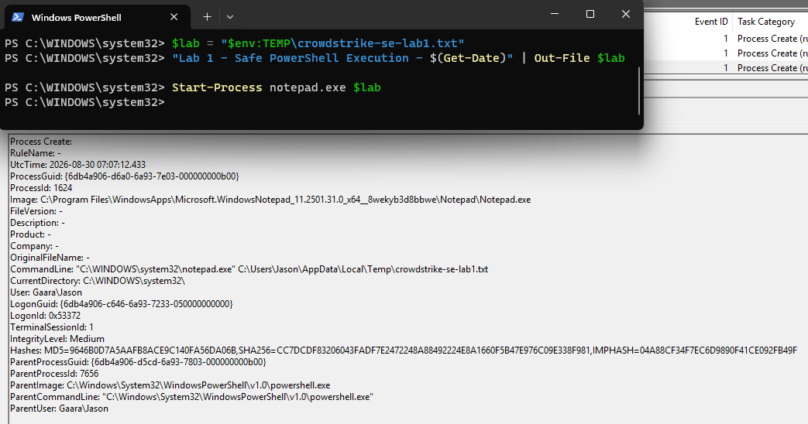
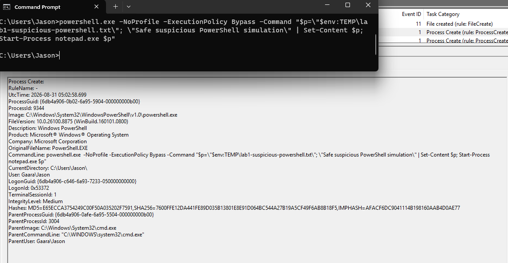
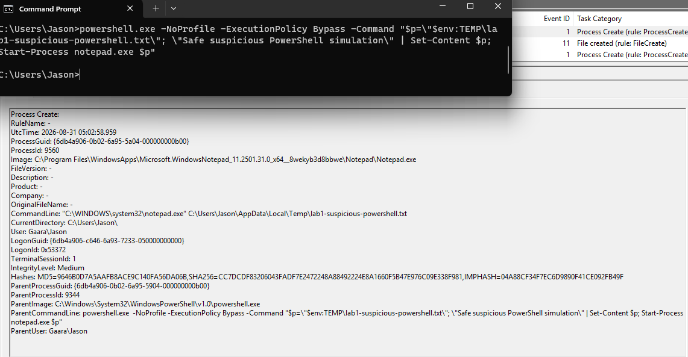

# Lab 01 — Suspicious PowerShell and Endpoint Execution

## Objective

The purpose of this lab is to learn how Windows process activity can be investigated using endpoint telemetry.

The lab begins with a **benign baseline** using PowerShell and Notepad. PowerShell is used to create a harmless text file and launch `notepad.exe`. This activity is expected and non-malicious.

The goal is to examine the resulting process relationship and understand why process ancestry, command-line information, user context, and follow-on behavior are more useful than looking at a process name by itself.

## Environment

- Windows 11 victim VM
- Kali Linux attacker VM
- VMware Workstation
- Host-only isolated network
- Microsoft Defender enabled
- Sysmon
- System Informer

> CrowdStrike Falcon is not installed in this home lab. Any CrowdStrike mappings in this project are based on documented Falcon capabilities and are kept separate from the telemetry observed in the Windows lab.

## Benign Baseline Activity

Before introducing suspicious PowerShell behavior, I created a normal and predictable process chain to establish a baseline.

PowerShell was used to:

1. Create a harmless text file in the Windows temporary directory.
2. Launch `notepad.exe`.
3. Open the text file in Notepad.

The resulting process relationship was:

```text
powershell.exe
      ↓
notepad.exe
```



## Suspicious PowerShell Simulation

After establishing a benign PowerShell baseline, I performed a safe simulation designed to create more suspicious execution context without using malware or destructive behavior.

The command was launched from `cmd.exe`, which then started PowerShell with the following parameters:

- `-NoProfile`
- `-ExecutionPolicy Bypass`
- `-Command`

The PowerShell command created a harmless text file and opened it in Notepad.

The resulting process relationship was:

```text
cmd.exe
   ↓
powershell.exe
```



*Safe suspicious PowerShell simulation: Sysmon Event ID 1 records `powershell.exe` launched by `cmd.exe` with `-NoProfile` and `-ExecutionPolicy Bypass`. These parameters do not prove malicious activity, but the parent-child relationship and command-line context provide additional reasons for an analyst to investigate the execution.*

### Follow-On Process Activity

After the suspicious PowerShell process was created, Sysmon recorded the next process in the execution chain: `Notepad.exe`.

The event shows that `powershell.exe` was the parent process responsible for launching Notepad. The `ParentCommandLine` field also preserves the PowerShell command-line context from the previous event, including:

- `-NoProfile`
- `-ExecutionPolicy Bypass`
- the scripted command that created and opened the harmless test file

This allows the individual Sysmon events to be correlated into a larger process sequence rather than analyzed in isolation.

The resulting process chain was:

```text
cmd.exe
   ↓
powershell.exe
   ↓
Notepad.exe
```

#### Sysmon Event ID 1 — PowerShell Launching Notepad

.

*Follow-on process activity: Sysmon Event ID 1 records `Notepad.exe` launched by `powershell.exe`. The parent command line preserves the earlier PowerShell execution context, allowing this event to be correlated with the previous `cmd.exe → powershell.exe` process-creation event.*
