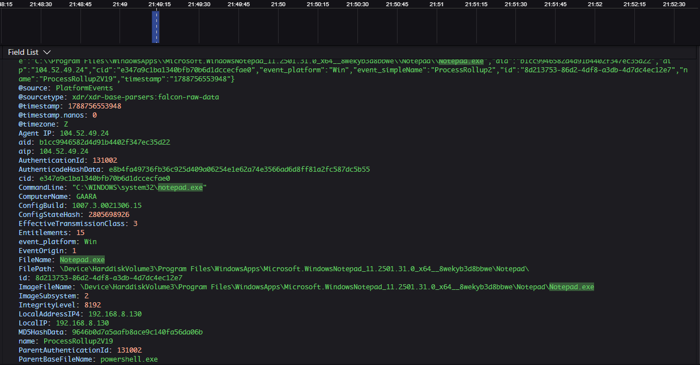
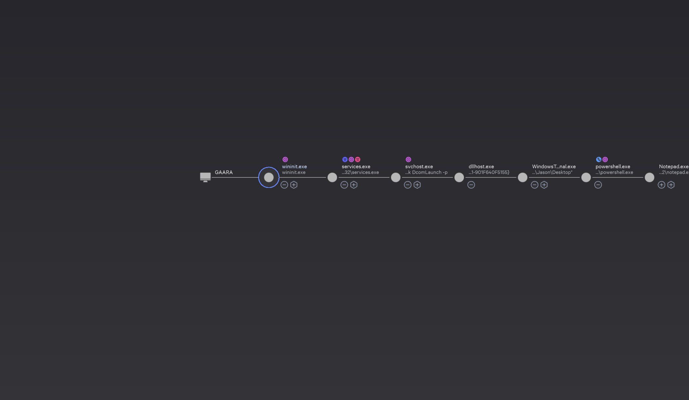
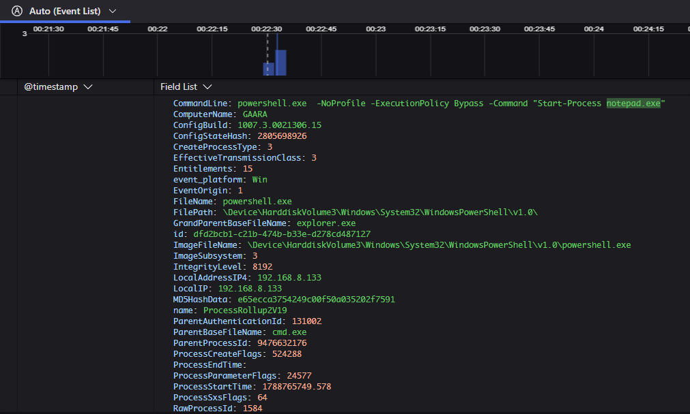
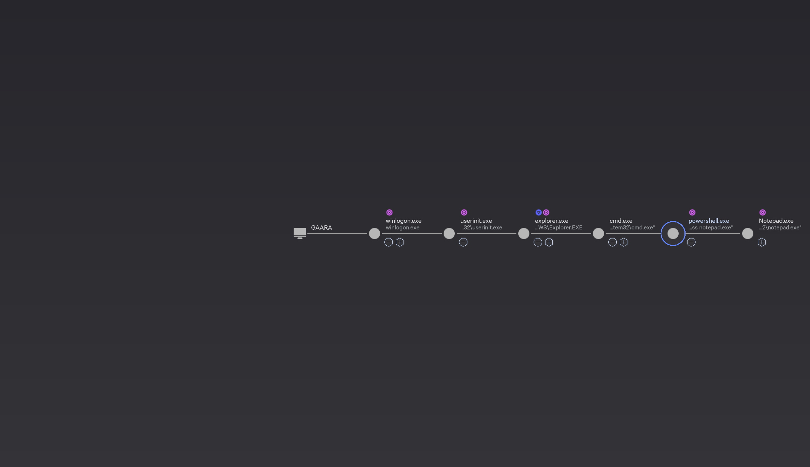

# Lab 01 — Suspicious PowerShell and Endpoint Execution

## Executive Summary

This lab demonstrates how endpoint telemetry can be used to distinguish normal PowerShell execution from activity that warrants further investigation.

Using a Windows 11 virtual machine with CrowdStrike Falcon, Sysmon, and System Informer, I captured process ancestry and command-line context for benign and suspicious-looking PowerShell activity. Falcon telemetry was used to examine process relationships and execution context, while Sysmon provided supplemental Windows telemetry for validation.

The observed behavior was mapped to MITRE ATT&CK T1059.001 — PowerShell where supported by the executed activity.

## Objective

The purpose of this lab is to learn how Windows process activity can be investigated using endpoint telemetry.

The lab begins with a **benign baseline** using PowerShell and Notepad. PowerShell is used to create a harmless text file and launch `notepad.exe`. This activity is expected and non-malicious.

The goal is to examine the resulting process relationship and understand why process ancestry, command-line information, user context, and follow-on behavior are more useful than looking at a process name by itself.

## Environment

- Windows 11 victim VM
- Kali Linux attacker VM
- VMware Workstation
- Host-only isolated network
- Microsoft Defender enabled
- Sysmon
- System Informer
- CrowdStrike Falcon sensor installed and communicating
- Falcon prevention policy configured for controlled detect-only lab observation


## Benign Baseline Activity

Before introducing suspicious PowerShell behavior, I created a normal and predictable process chain to establish a baseline.

PowerShell was used to launch `notepad.exe`.

The resulting process relationship was:

```text
WindowsTerminal.exe
        ↓
powershell.exe
        ↓
Notepad.exe
```


Falcon recorded the execution as endpoint telemetry. The process event showed Notepad.exe with powershell.exe as its parent process, while the Falcon process tree provided the broader execution ancestry.

This activity did not represent malicious behavior. The purpose of the baseline was to demonstrate that PowerShell is a legitimate administrative tool and that process ancestry and command-line context are necessary to understand whether PowerShell activity deserves investigation.

### Falcon Telemetry



*Falcon telemetry showing legitimate `Notepad.exe` execution with `powershell.exe` as the parent process, establishing the benign PowerShell baseline.*

### Falcon Process Tree



*Falcon process tree showing a normal interactive PowerShell session launched from Windows Terminal and spawning Notepad.*
## Suspicious PowerShell Simulation

After establishing a benign PowerShell baseline, I performed a safe simulation designed to create more suspicious execution context without using malware or destructive behavior.

The command was launched from `cmd.exe`, which then started PowerShell with the following parameters:

- `-NoProfile`
- `-ExecutionPolicy Bypass`
- `-Command`

The PowerShell command created a harmless text file and opened it in Notepad.

The resulting process relationship was:

```text
cmd.exe
   ↓
powershell.exe
```


*Safe suspicious PowerShell simulation: Sysmon Event ID 1 records `powershell.exe` launched by `cmd.exe` with `-NoProfile` and `-ExecutionPolicy Bypass`. These parameters do not prove malicious activity, but the parent-child relationship and command-line context provide additional reasons for an analyst to investigate the execution.*

### Follow-On Process Activity

After the suspicious PowerShell process was created, Sysmon recorded the next process in the execution chain: `Notepad.exe`.

The event shows that `powershell.exe` was the parent process responsible for launching Notepad. The `ParentCommandLine` field also preserves the PowerShell command-line context from the previous event, including:

- `-NoProfile`
- `-ExecutionPolicy Bypass`
- the scripted command that created and opened the harmless test file

This allows the individual Sysmon events to be correlated into a larger process sequence rather than analyzed in isolation.

The resulting process chain was:

```text
cmd.exe
   ↓
powershell.exe
   ↓
Notepad.exe
```

#### Sysmon Event ID 1 — PowerShell Launching Notepad

.

*Follow-on process activity: Sysmon Event ID 1 records `Notepad.exe` launched by `powershell.exe`. The parent command line preserves the earlier PowerShell execution context, allowing this event to be correlated with the previous `cmd.exe → powershell.exe` process-creation event.*

### Falcon Suspicious Execution Telemetry

Falcon recorded the suspicious-looking PowerShell execution as endpoint telemetry.

The PowerShell event showed:

- `powershell.exe` as the process
- `cmd.exe` as the parent process
- `explorer.exe` as the grandparent process
- the full command line containing `-NoProfile` and `-ExecutionPolicy Bypass`

No Falcon detection was generated for this harmless simulation. The activity was still visible for investigation through Falcon telemetry.



*Falcon telemetry showing `cmd.exe` launching PowerShell with `-NoProfile` and `-ExecutionPolicy Bypass`, providing suspicious execution context without generating a detection.*

### Falcon Suspicious Process Tree

Falcon reconstructed the execution chain as:



*Falcon process tree showing `cmd.exe` launching PowerShell with `-NoProfile` and `-ExecutionPolicy Bypass`, which then launched `Notepad.exe`. The execution produced telemetry but no Falcon detection.*


## Benign vs Suspicious Comparison

| Benign Baseline | Suspicious Variant |
|---|---|
| `WindowsTerminal.exe → powershell.exe → Notepad.exe` | `explorer.exe → cmd.exe → powershell.exe → Notepad.exe` |
| Normal interactive PowerShell execution | PowerShell launched from `cmd.exe` |
| Simple `Start-Process notepad.exe` activity | Used `-NoProfile` and `-ExecutionPolicy Bypass` |
| Falcon recorded normal process telemetry | Falcon recorded the full suspicious-looking execution context |
| No detection generated | No detection generated |

The important difference was not the presence of `powershell.exe` or `Notepad.exe` by themselves. Falcon provided the process ancestry and command-line context needed to understand how the activity was executed and why the suspicious variant would deserve more analyst attention.

## MITRE ATT&CK Mapping

| Observed Behavior | Technique | ID | Evidence | Why It Fits |
|---|---|---|---|---|
| PowerShell executed scripted commands and launched a child process | Command and Scripting Interpreter: PowerShell | T1059.001 | Sysmon Event ID 1 showing `powershell.exe`, its command line, parent process, and follow-on `Notepad.exe` execution | PowerShell was used as the command and scripting interpreter to execute the simulated activity |


### Mapping Notes

This mapping is based on the behavior that was actually observed in the lab.

The presence of PowerShell alone does not indicate malicious activity. PowerShell is a legitimate Windows administrative tool. The ATT&CK mapping reflects that PowerShell was used for command execution during the simulation, while the surrounding process ancestry and command-line context provide the information needed for further investigation.


## How CrowdStrike Falcon Maps to This Scenario

CrowdStrike Falcon was installed and communicating on the Windows 11 endpoint during this lab.

Falcon recorded both the benign and suspicious PowerShell executions as endpoint telemetry. In the benign baseline, Falcon showed a normal interactive PowerShell session launching `Notepad.exe`. In the suspicious variant, Falcon showed `cmd.exe` launching `powershell.exe` with `-NoProfile` and `-ExecutionPolicy Bypass`, followed by `Notepad.exe`.

No Falcon detection was generated for the harmless suspicious simulation. The value of the lab was the visibility Falcon provided into process ancestry, command-line context, user context, and the full execution chain.

This demonstrated how Falcon can help an analyst distinguish between legitimate PowerShell use and activity that deserves further investigation based on execution context.

### Detection Opportunity

The lab demonstrated that PowerShell itself is not automatically malicious.

The more useful security context came from:

- the parent process that launched PowerShell;
- the PowerShell command line;
- the arguments used during execution;
- the child process launched by PowerShell;
- the sequence of related process activity.

This type of context helps an analyst distinguish expected administrative activity from behavior that may require additional investigation.

### Falcon Insight XDR

Falcon Insight XDR was relevant to this lab because it provided endpoint telemetry and investigation context for both the benign and suspicious PowerShell executions.

The most useful evidence was the process ancestry and command-line detail that showed how the activity was launched and what happened next.

In this lab, that visibility helped distinguish normal PowerShell use from a more suspicious execution pattern without relying on a detection alone.

### Falcon Prevent

Falcon Prevent is CrowdStrike's endpoint prevention capability.

In this controlled lab, the prevention policy was configured to prioritize observation so the suspicious PowerShell behavior could execute and be investigated.

This particular PowerShell simulation was intentionally harmless and did not generate a Falcon detection or prevention action.

The lab therefore demonstrates visibility and investigation rather than prevention.

### Investigation

The investigation workflow demonstrated in this lab was:

```text
Process created
      ↓
Identify parent process
      ↓
Review command line
      ↓
Identify child process
      ↓
Correlate related activity
      ↓
Determine whether additional investigation is required
```

## Detection vs Prevention vs Investigation vs Response

### Detection

Detection is the process of identifying activity that may be suspicious or malicious.

In this lab, the PowerShell process itself was not automatically malicious. The more meaningful detection opportunity came from the surrounding context, including the parent process, command-line arguments, and follow-on process activity.

### Prevention

Prevention is the process of stopping malicious activity from successfully executing or causing its intended effect.

This lab was configured to prioritize observation rather than blocking. The PowerShell activity was intentionally harmless, and Falcon did not generate a prevention action for this simulation.

### Investigation

Investigation is the process of determining what happened after activity has been observed or detected.

In this lab, investigation included reviewing:

- the parent process;
- the PowerShell command line;
- the execution arguments;
- the child process;
- the sequence of related Sysmon events.

This context helped reconstruct the process chain:

```text
cmd.exe
   ↓
powershell.exe
   ↓
Notepad.exe
```
## Customer Discovery Questions

### 1. How do your analysts currently investigate suspicious PowerShell activity?

**Why it matters:**  
This helps uncover what telemetry, EDR, SIEM, or manual investigation steps the team relies on today.

**Useful follow-up:**  
What information usually helps your team decide whether the activity is legitimate or malicious?

---

### 2. Can your analysts easily see process ancestry and command-line context?

**Why it matters:**  
Parent-child relationships and command-line details can help distinguish normal administrative activity from behavior that deserves investigation.

**Useful follow-up:**  
If that context is spread across multiple tools, how does that affect investigation time?

---

### 3. When an endpoint alert appears, how quickly can your team determine what happened?

**Why it matters:**  
Detection alone is not enough. Analysts need enough context to reconstruct the activity and decide what action to take.

**Useful follow-up:**  
What usually slows down endpoint investigations today?

---

### 4. If suspicious activity appears on one endpoint, can you quickly determine whether similar behavior occurred elsewhere?

**Why it matters:**  
This helps uncover the customer's ability to scope activity across the environment and search for related behavior.

**Useful follow-up:**  
Can your team do that from one platform, or does it require multiple tools?

## Discovery Approach

The goal of discovery is not to immediately pitch a product.

A stronger Sales Engineering approach is:

```text
Question
   ↓
Listen
   ↓
Clarify
   ↓
Quantify the impact
   ↓
Connect a relevant capability
   ↓
Confirm that the capability addresses the customer's problem
```

## Business Value

PowerShell is a legitimate administrative tool, so a process name alone is not enough to determine whether activity is malicious.

In this lab, Falcon provided the process ancestry and command-line context needed to understand how the activity executed and why the suspicious variant deserved more attention.

For a security team, that context can support faster triage, more confident investigations, and less time spent manually reconstructing endpoint activity across multiple tools.


## Limitations

This lab was designed as a safe endpoint-investigation exercise and does not represent a real malware infection or compromised production system.

Key limitations include:

- The PowerShell activity was intentionally harmless.
- No real malware, credential theft, persistence, lateral movement, or destructive behavior was performed.
- `-ExecutionPolicy Bypass` and `-NoProfile` were used to create more suspicious-looking command-line context, but their presence alone does not prove malicious activity.
- Falcon recorded the activity as endpoint telemetry, but no detection was generated for the suspicious simulation.
- The lab demonstrates process ancestry, command-line investigation, and benign-vs-suspicious comparison rather than a complete incident-response workflow.
- Sysmon was used as supplemental Windows telemetry to corroborate selected process activity.
- The Sysmon configuration did not capture an Event ID 11 for the specific test file created during the earlier suspicious PowerShell simulation.

The purpose of the lab was to demonstrate how execution context changes the interpretation of PowerShell activity and how Falcon telemetry can help an analyst investigate those differences.

## What I Learned

From this lab, I learned that just because something is launched in an unusual way or appears suspicious does not automatically mean it is malicious.

The value of endpoint telemetry is having enough context to determine what actually happened. By reviewing process ancestry, command-line activity, and follow-on behavior, an analyst can make a more informed decision about whether activity is legitimate or requires further investigation.

I also learned how detection, prevention, investigation, and response serve different purposes. Having the right endpoint visibility helps a security team move from simply seeing an event to understanding it and deciding what action, if any, is needed.

