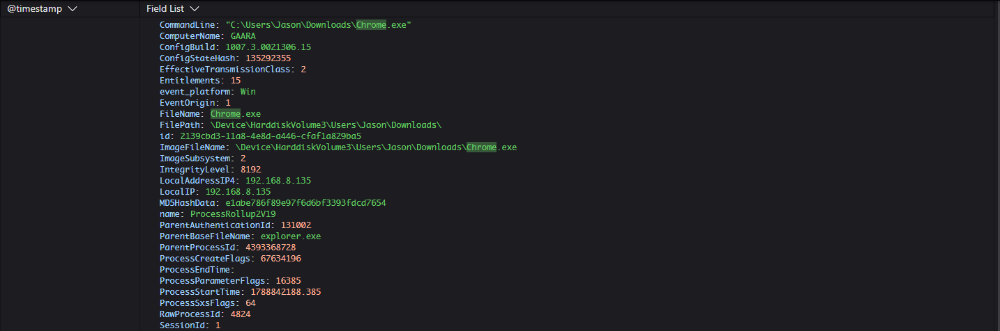
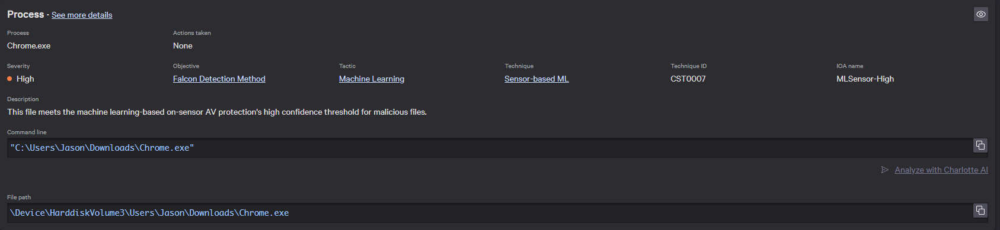
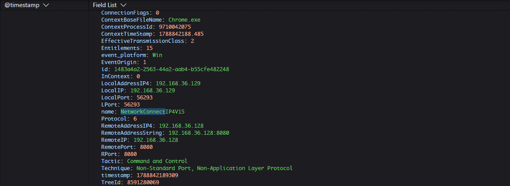

# Lab 02 — PowerShell Network Activity and Command-and-Control Behavior

## Executive Summary

This lab demonstrates how endpoint telemetry can be used to investigate suspicious PowerShell activity that results in outbound network communication.

Using a Windows 11 virtual machine with CrowdStrike Falcon and Sysmon, I captured PowerShell process creation and network activity associated with communication to a Kali Linux system.

Sysmon Event ID 1 recorded the PowerShell process and command line, while Sysmon Event ID 3 recorded the outbound connection. The matching `ProcessGuid` values allowed the two events to be correlated to the same PowerShell process.

The lab also progressed into a reverse-shell simulation while Falcon prevention was disabled. Falcon generated a high-severity detection and preserved the associated process and network telemetry for investigation.

## Objective

The objective of this lab is to understand how endpoint process and network telemetry can be correlated when investigating suspicious PowerShell activity.

The lab focuses on:

- identifying PowerShell process execution;
- reviewing command-line context;
- identifying outbound network activity;
- correlating process and network events;
- understanding how Falcon provides detection and investigation visibility when prevention is disabled.

The activity was performed in an isolated lab environment and was designed for safe security testing.

## Environment

- Windows 11 victim VM
- Kali Linux attacker VM
- VMware Workstation
- Host-only isolated network
- Windows victim IP: `192.168.36.129`
- Kali attacker IP: `192.168.36.128`
- Microsoft Defender enabled
- Sysmon
- CrowdStrike Falcon sensor installed and communicating
- Falcon prevention policy configured for controlled detect-only lab observation

## Benign Baseline

Before introducing reverse-shell behavior, I generated a harmless outbound HTTP request from PowerShell to the Kali Linux VM.

The PowerShell command was:

```powershell
Invoke-WebRequest http://192.168.36.128:8081 | Out-Null
```

### Falcon Command History

Falcon recorded the PowerShell command, including the destination IP address and port used during the test.


*Falcon command-history telemetry showing a harmless PowerShell `Invoke-WebRequest` to the Kali Linux VM at `192.168.36.128:8081`.*

### Falcon Network Telemetry

Falcon also recorded the corresponding outbound network connection from the Windows endpoint at `192.168.36.129` to the Kali system at `192.168.36.128:8081`.


*Falcon network telemetry showing the PowerShell process communicating with `192.168.36.128` over TCP port `8081`.*


### Sysmon Event Correlation

Sysmon provided supplemental Windows telemetry for the suspicious PowerShell activity.

Event ID 1 recorded the PowerShell process creation and command line, while Event ID 3 recorded the outbound network connection to the Kali Linux system at `192.168.36.128:8081`.

The two events shared the same `ProcessGuid`, allowing them to be correlated to the same PowerShell process.

### Sysmon Event ID 1 — PowerShell Process Creation


*Sysmon Event ID 1 showing `powershell.exe` launched with the command used during the lab simulation.*

### Sysmon Event ID 3 — PowerShell Network Connection


*Sysmon Event ID 3 showing `powershell.exe` initiating a TCP connection to the Kali Linux VM at `192.168.36.128:8081`.*

### Process Correlation

Both Sysmon events contained the same process identifier:

```text
ProcessGuid: {6db4a906-c9be-6a97-9601-000000000f00}
```

## Suspicious Reverse-Shell Activity

After establishing the benign PowerShell network baseline, I progressed the lab into a reverse-shell simulation.

The goal was to create behavior that more closely resembled command-and-control activity and compare the resulting telemetry with the benign HTTP request.

Unlike the baseline activity, the reverse-shell simulation produced behavior that Falcon identified as suspicious and generated a high-severity detection.

### Falcon High-Severity Detection

Falcon generated a high-severity detection associated with the executable used during the reverse-shell simulation.

The process tree showed the execution path leading to the detected process and provided additional execution details, including the user context, command line, file path, and executable hash.


*Falcon process tree and execution details showing a high-severity detection associated with the reverse-shell simulation. Prevention was disabled during the lab, so the activity was available for investigation rather than being blocked.*

### Falcon Process Event

Falcon recorded the suspicious executable as a process event and preserved important execution context, including the command line, file path, parent process, and process identifiers.



*Falcon process telemetry showing `Chrome.exe` executing from the user's Downloads directory with `explorer.exe` as the parent process.*

### Falcon Machine-Learning Detection Details

Falcon classified the executable as a high-severity detection using its sensor-based machine-learning detection logic.

The detection details showed:

- Severity: `High`
- Technique: `Sensor-based ML`
- Technique ID: `CST0007`
- IOA name: `MLSensor-High`
- Actions taken: `None`

Because prevention was disabled during the lab, Falcon generated the detection without taking a blocking action.



*Falcon detection details showing a high-confidence sensor-based machine-learning detection for the executable used during the reverse-shell simulation.*

### Falcon Network Connection

Falcon also recorded the detected process establishing an outbound TCP connection to the Kali Linux VM.

The network telemetry showed:

```text
Windows endpoint: 192.168.36.129
Remote system:    192.168.36.128
Remote port:      8080
Protocol:         TCP
```



*Falcon network telemetry showing `Chrome.exe` communicating with the Kali Linux VM at `192.168.36.128:8080` during the reverse-shell simulation.*

## Benign vs Suspicious Comparison

| Benign Baseline | Suspicious Reverse-Shell Activity |
|---|---|
| PowerShell made a controlled HTTP request to `192.168.36.128:8081` | Reverse-shell behavior created more suspicious execution context |
| Falcon recorded command-history telemetry | Falcon generated a high-severity detection |
| Falcon recorded the outbound network connection | Falcon provided process-tree and execution details for investigation |
| Activity was intentionally harmless | Activity was designed to emulate command-and-control behavior |
| No malicious payload was used | Reverse-shell behavior was intentionally simulated in the isolated lab |
| Prevention was not triggered | Prevention was disabled, so the activity remained available for investigation |

The key difference was not simply that PowerShell communicated over the network. Both the benign and suspicious activities involved outbound communication.

The more useful distinction came from the surrounding execution context, related process activity, and Falcon's detection logic. This demonstrated why analysts need to evaluate the full behavior rather than treating a single process name or network connection as proof of malicious activity.


## Investigation Findings

The lab showed how process and network telemetry can be correlated to reconstruct suspicious endpoint activity.

Sysmon Event ID 1 recorded the PowerShell process creation, while Event ID 3 recorded the outbound TCP connection to `192.168.36.128:8081`.

Both events shared the same `ProcessGuid`:

```text
{6db4a906-c9be-6a97-9601-000000000f00}
```
This allowed the process-creation event and network-connection event to be tied to the same PowerShell execution.

Falcon provided additional endpoint context, including command-history telemetry, network telemetry, process relationships, and a high-severity detection during the reverse-shell simulation.

The investigation demonstrated that the most useful evidence came from correlating:

- process execution;
- command-line activity;
- network connections;
- process relationships;
- detection context.

This combination provided a clearer picture of what occurred than any single event viewed by itself.

## MITRE ATT&CK Mapping

| Observed Behavior | Technique | ID | Evidence | Why It Fits |
|---|---|---|---|---|
| PowerShell executed commands during the simulation | Command and Scripting Interpreter: PowerShell | T1059.001 | Sysmon Event ID 1 and Falcon command-history telemetry | PowerShell was used as the command interpreter during the simulated activity |
| PowerShell established outbound communication with the Kali Linux VM | Non-Standard Port | T1571 | Sysmon Event ID 3 and Falcon network telemetry showing communication with `192.168.36.128:8081` | The lab used TCP port `8081` for controlled communication between the Windows and Kali systems |

### Mapping Notes

The ATT&CK mappings are based only on behavior observed during the lab.

PowerShell and outbound network communication are not automatically malicious. The surrounding process context, command line, network destination, related events, and Falcon detection provided the additional information needed to determine whether the activity deserved investigation.

The reverse-shell simulation was performed in an isolated lab environment and was intended to reproduce behavior associated with command-and-control activity without representing a real-world compromise.

## How CrowdStrike Falcon Maps to This Scenario

CrowdStrike Falcon provided the primary endpoint visibility used to investigate the activity in this lab.

During the benign baseline, Falcon recorded both the PowerShell command and the associated outbound network connection to the Kali Linux VM.

During the reverse-shell simulation, Falcon generated a high-severity detection and provided additional context through the process tree and execution details.

This demonstrated how Falcon can help an analyst move from simply observing a network connection to understanding:

- which process initiated the activity;
- what command was executed;
- where the connection was directed;
- how the process was launched;
- whether related behavior triggered a detection.

  
### Detection Opportunity

The lab demonstrated that a single PowerShell process or outbound connection is not enough to determine whether activity is malicious.

More useful detection context came from combining:

- process ancestry;
- command-line activity;
- network destination and port;
- related process behavior;
- Falcon detection context.

The benign HTTP request produced telemetry without representing malicious activity, while the reverse-shell simulation generated a high-severity Falcon detection.

This comparison demonstrated why behavior and execution context are more useful than relying on a process name or network connection by itself.

### Falcon Insight XDR

Falcon Insight XDR provides endpoint detection and response capabilities that help analysts investigate suspicious activity across process, command-line, and network telemetry.

In this lab, Falcon provided visibility into both the benign and suspicious activity and allowed the execution context to be reviewed through related endpoint events and process relationships.

The value was not simply knowing that PowerShell or another process executed. The value came from being able to understand how the activity occurred and determine whether it required further investigation.

## Detection vs Prevention vs Investigation vs Response

### Detection

Detection is the process of identifying activity that may be suspicious or malicious.

In this lab, Falcon generated a high-severity detection for the executable used during the reverse-shell simulation. The detection details showed that Falcon's sensor-based machine-learning logic classified the file as suspicious.

### Prevention

Prevention is the process of stopping malicious activity from successfully executing or continuing.

Prevention was disabled during this lab, and Falcon showed:

```text
Actions taken: None
```

### Response and Remediation

If investigation confirmed that the endpoint was compromised, CrowdStrike response capabilities such as Real Time Response could be used to assist with remediation.

This creates a simple security workflow:

**Prevent → Detect and Investigate → Respond**

## Customer Discovery Questions

A Sales Engineer should understand how the customer currently detects, investigates, and responds to suspicious endpoint and network activity before recommending a solution.

### 1. How do you currently detect suspicious outbound connections from endpoints?

**Why it matters:**  
This helps identify whether the customer relies on EDR, firewall logs, SIEM alerts, network tools, or a combination of systems.

**Useful follow-up:**  
Can your analysts easily identify which process created the connection?

---

### 2. Can your analysts correlate process execution with network activity?

**Why it matters:**  
A network connection by itself does not explain how the activity started. Process and command-line context can help determine whether the behavior is legitimate or suspicious.

**Useful follow-up:**  
How many different tools do analysts need to use to reconstruct that activity?

---

### 3. How quickly can your team investigate suspicious command-and-control behavior?

**Why it matters:**  
This helps uncover whether analysts have enough context to understand what happened without spending significant time manually correlating logs.

**Useful follow-up:**  
What usually slows down that investigation?

---

### 4. If suspicious activity is detected but not automatically blocked, what happens next?

**Why it matters:**  
This helps identify the customer's response process and whether analysts can quickly contain or remediate affected endpoints.

**Useful follow-up:**  
Who is responsible for deciding when an endpoint should be isolated?


## Business Value

This lab demonstrates why endpoint visibility is valuable when investigating suspicious network activity.

A network connection by itself does not explain what caused it. By combining process execution, command-line activity, network telemetry, and detection context, an analyst can understand how the activity started and what happened next.

In this lab, Falcon provided visibility into:

- the process responsible for the connection;
- the command and execution context;
- the destination IP address and port;
- related process activity;
- the high-severity detection generated during the reverse-shell simulation.

From an operational perspective, this type of context can help reduce the time analysts spend manually correlating activity across separate tools and logs.

For a security team, that can support:

- faster triage;
- quicker investigation of suspicious connections;
- more informed response decisions;
- improved ability to distinguish benign activity from command-and-control behavior.

For a security leader, the value is not simply collecting more telemetry. The value is giving analysts enough context to understand suspicious endpoint behavior quickly and make confident decisions about what should happen next.

## SE Talk Track

"In this lab, I compared benign PowerShell network activity with a reverse-shell simulation.

Falcon gave me visibility into the process, command line, network connection, and related execution context. When the suspicious activity occurred, Falcon also generated a high-severity detection.

The key takeaway is that security teams need more than an alert. They need enough context to understand what happened, determine whether the activity is legitimate or malicious, and decide what action to take next."

## Limitations

This lab was designed as a controlled endpoint-investigation exercise and does not represent a real production compromise.

Key limitations include:

- The activity was performed in an isolated VMware lab environment.
- The reverse-shell simulation was intentionally controlled for demonstration purposes.
- Falcon prevention was disabled, so no blocking action was expected.
- The lab focused on endpoint telemetry, detection, and investigation rather than full incident response.
- Sysmon was used as supplemental telemetry to validate process and network activity.
- The observed behavior demonstrates one example of suspicious command-and-control activity and does not represent every possible reverse-shell technique.

## What I Learned

This lab reinforced the importance of correlating process and network activity during an endpoint investigation.

A network connection alone does not explain what happened. By reviewing the process that created the connection, the command line, related telemetry, and Falcon detection context, I was able to reconstruct the activity more accurately.

I also learned the difference between telemetry, detection, prevention, investigation, and response. In this lab, Falcon provided visibility and generated a high-severity detection while prevention remained disabled.

The main takeaway was that strong endpoint visibility helps analysts understand not only that suspicious activity occurred, but how it happened and what should be investigated next.


