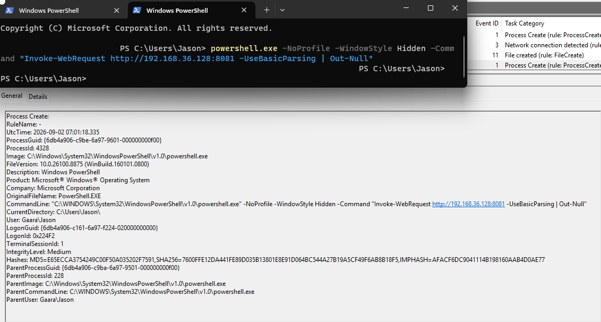
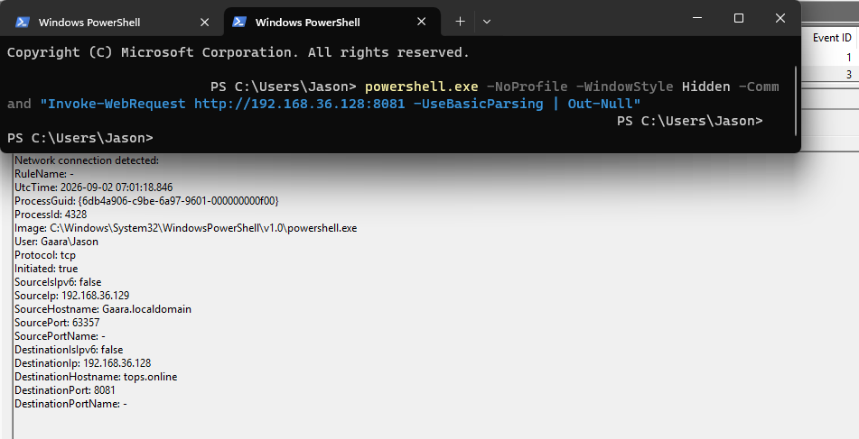

## Investigation Findings

The Windows endpoint executed a PowerShell command using the `-NoProfile` and `-WindowStyle Hidden` options. The command used `Invoke-WebRequest` to connect to the Kali Linux system at `192.168.36.128` over TCP port `8081`.

Sysmon Event ID 1 captured the creation of the PowerShell process, including the full command line and parent process information.

Sysmon Event ID 3 captured the outbound network connection initiated by the same PowerShell process.

The `ProcessGuid` value matched between both events:

`{6db4a906-c9be-6a97-9601-000000000f00}`

This confirmed that the PowerShell process captured in Event ID 1 was the same process responsible for the outbound connection captured in Event ID 3.

## Why This Matters

PowerShell is a legitimate Windows administration tool, but it can also be abused by attackers.

Looking only at the existence of `powershell.exe` provides limited context. Endpoint telemetry makes it possible to investigate how PowerShell was launched, what command it executed, and what network activity resulted from that execution.

In this lab, process creation and network telemetry were correlated to reconstruct the sequence of events rather than viewing each event in isolation.
