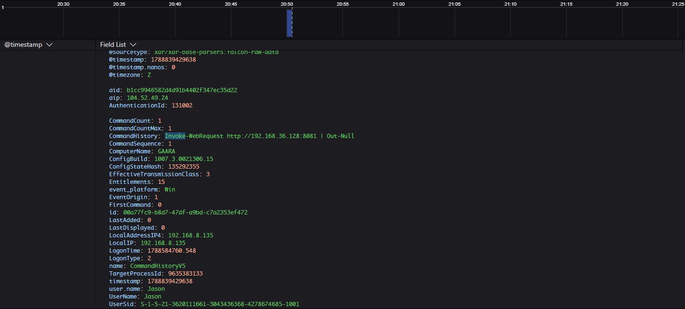
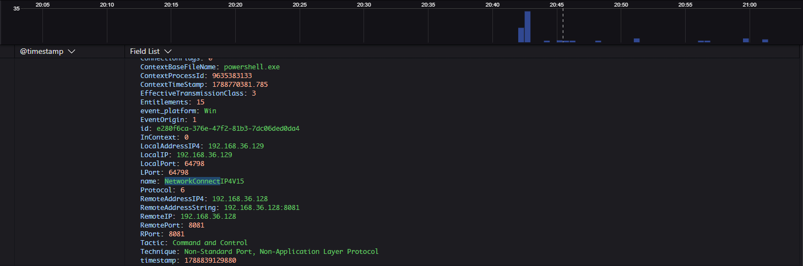
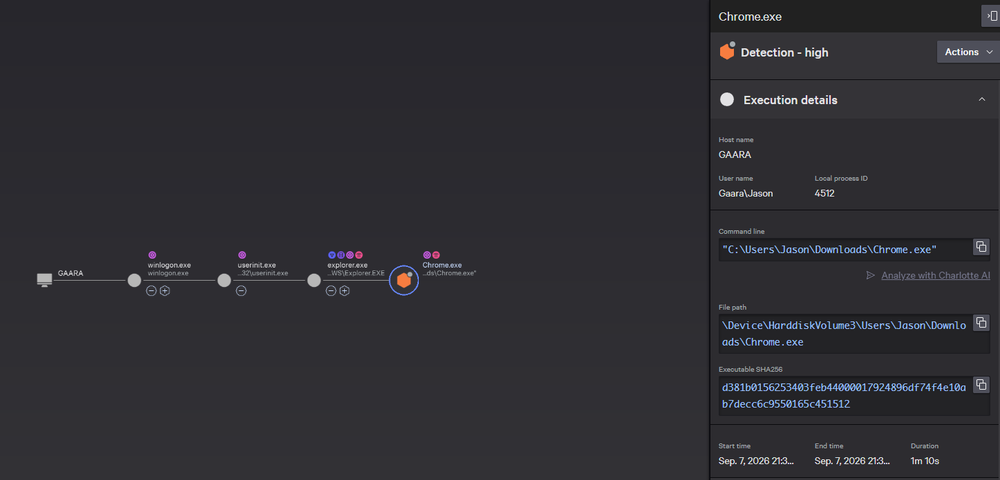

# Lab 02 — PowerShell Network Activity and Command-and-Control Behavior

## Executive Summary

This lab demonstrates how endpoint telemetry can be used to investigate suspicious PowerShell activity that results in outbound network communication.

Using a Windows 11 virtual machine with CrowdStrike Falcon and Sysmon, I captured PowerShell process creation and network activity associated with communication to a Kali Linux system.

Sysmon Event ID 1 recorded the PowerShell process and command line, while Sysmon Event ID 3 recorded the outbound connection. The matching `ProcessGuid` values allowed the two events to be correlated to the same PowerShell process.

The lab also progressed into a reverse-shell simulation that CrowdStrike Falcon blocked, demonstrating the difference between telemetry used for investigation and prevention triggered by more suspicious behavior.

## Objective

The objective of this lab is to understand how endpoint process and network telemetry can be correlated when investigating suspicious PowerShell activity.

The lab focuses on:

- identifying PowerShell process execution;
- reviewing command-line context;
- identifying outbound network activity;
- correlating process and network events;
- understanding how Falcon can provide both investigation visibility and prevention.

The activity was performed in an isolated lab environment and was designed for safe security testing.

## Environment

- Windows 11 victim VM
- Kali Linux attacker VM
- VMware Workstation
- Host-only isolated network
- Windows victim IP: `192.168.36.129`
- Kali attacker IP: `192.168.36.128`
- Microsoft Defender enabled
- Sysmon
- CrowdStrike Falcon sensor installed and communicating
- Falcon prevention policy configured for controlled detect-only lab observation

## Benign Baseline

Before introducing reverse-shell behavior, I generated a harmless outbound HTTP request from PowerShell to the Kali Linux VM.

The PowerShell command was:

```powershell
Invoke-WebRequest http://192.168.36.128:8081 | Out-Null
```

### Falcon Command History

Falcon recorded the PowerShell command, including the destination IP address and port used during the test.



*Falcon command-history telemetry showing a harmless PowerShell `Invoke-WebRequest` to the Kali Linux VM at `192.168.36.128:8081`.*

### Falcon Network Telemetry

Falcon also recorded the corresponding outbound network connection from the Windows endpoint at `192.168.36.129` to the Kali system at `192.168.36.128:8081`.



*Falcon network telemetry showing the PowerShell process communicating with `192.168.36.128` over TCP port `8081`.*


## Suspicious Reverse-Shell Activity

After establishing the benign PowerShell network baseline, I progressed the lab into a reverse-shell simulation.

The goal was to create behavior that more closely resembled command-and-control activity and compare the resulting telemetry with the benign HTTP request.

Unlike the baseline activity, the reverse-shell simulation produced behavior that Falcon identified as suspicious and generated a high-severity detection.

### Falcon High-Severity Detection

Falcon generated a high-severity detection associated with the executable used during the reverse-shell simulation.

The process tree showed the execution path leading to the detected process and provided additional execution details, including the user context, command line, file path, and executable hash.



*Falcon process tree and execution details showing a high-severity detection associated with the reverse-shell simulation. Prevention was disabled during the lab, so the activity was available for investigation rather than being blocked.*
### Sysmon Event Correlation

Sysmon provided supplemental Windows telemetry for the suspicious PowerShell activity.

Event ID 1 recorded the PowerShell process creation and command line, while Event ID 3 recorded the outbound network connection to the Kali Linux system at `192.168.36.128:8081`.

The two events shared the same `ProcessGuid`, allowing them to be correlated to the same PowerShell process.

### Sysmon Event ID 1 — PowerShell Process Creation


*Sysmon Event ID 1 showing `powershell.exe` launched with the command used during the lab simulation.*

### Sysmon Event ID 3 — PowerShell Network Connection


*Sysmon Event ID 3 showing `powershell.exe` initiating a TCP connection to the Kali Linux VM at `192.168.36.128:8081`.*

### Process Correlation

Both Sysmon events contained the same process identifier:

```text
ProcessGuid: {6db4a906-c9be-6a97-9601-000000000f00}

## Investigation Findings

The Windows endpoint executed a PowerShell command using the `-NoProfile` and `-WindowStyle Hidden` options. The command used `Invoke-WebRequest` to connect to the Kali Linux system at `192.168.36.128` over TCP port `8081`.

Sysmon Event ID 1 captured the creation of the PowerShell process, including the full command line and parent process information.


Sysmon Event ID 3 captured the outbound network connection initiated by the same PowerShell process.


The `ProcessGuid` value matched between both events:

`{6db4a906-c9be-6a97-9601-000000000f00}`

This confirmed that the PowerShell process captured in Event ID 1 was the same process responsible for the outbound connection captured in Event ID 3.

## Why This Matters

PowerShell is a legitimate Windows administration tool, but it can also be abused by attackers.

Looking only at the existence of `powershell.exe` provides limited context. Endpoint telemetry makes it possible to investigate how PowerShell was launched, what command it executed, and what network activity resulted from that execution.

In this lab, process creation and network telemetry were correlated to reconstruct the sequence of events rather than viewing each event in isolation.

## MITRE ATT&CK Mapping

### T1059.001 — PowerShell

This scenario maps to MITRE ATT&CK technique **T1059.001 — PowerShell**.

The Windows endpoint executed PowerShell with command-line options including `-NoProfile` and `-WindowStyle Hidden`, then used `Invoke-WebRequest` to initiate an outbound network connection.

PowerShell is a legitimate administrative tool, but attackers can abuse it for execution, scripting, reconnaissance, payload delivery, and other post-compromise activity.

In this lab, Sysmon telemetry was used to capture the PowerShell process creation and correlate it with the resulting network connection.

## How CrowdStrike Falcon Maps to This Scenario

This lab uses Sysmon to demonstrate endpoint telemetry concepts that an EDR platform such as CrowdStrike Falcon is designed to surface and correlate.

### Falcon Insight XDR

Falcon Insight XDR is the primary CrowdStrike capability that maps to this scenario.

The lab demonstrated:

- PowerShell process execution
- Parent-child process relationships
- Full command-line visibility
- Outbound network activity
- Correlation of process and network telemetry

In a Falcon investigation, this type of context helps analysts understand not only that suspicious activity occurred, but also how the process started, what command it executed, and what activity followed.

### Falcon Prevent

Falcon Prevent adds prevention capabilities designed to identify and stop malicious or suspicious behavior.

This lab did not use a CrowdStrike sensor and did not test whether Falcon Prevent would block the command. The PowerShell activity was intentionally benign and was used only to generate telemetry for investigation.

The purpose of this lab is to demonstrate the type of behavioral context an analyst would use when investigating potentially suspicious PowerShell activity.

### Response and Remediation

If investigation confirmed that the endpoint was compromised, CrowdStrike response capabilities such as Real Time Response could be used to assist with remediation.

This creates a simple security workflow:

**Prevent → Detect and Investigate → Respond**


## Business Value

Suspicious PowerShell activity can be difficult to evaluate because PowerShell is also widely used for legitimate administration.

The value of endpoint detection and response is the ability to provide context around that activity.

In this lab, process and network telemetry showed:

- How PowerShell was launched
- The full command line that was executed
- The destination IP address and port
- The relationship between the process creation and resulting network connection

This type of visibility can help a security team investigate suspicious behavior faster and make better decisions about whether activity is legitimate or malicious.

Instead of investigating isolated events, an analyst can reconstruct the sequence of activity and understand what occurred on the endpoint.

## SE Talk Track

In this lab, I simulated suspicious PowerShell activity on a Windows endpoint and used Sysmon to investigate what happened.

The process creation telemetry showed PowerShell launching with unusual command-line options and using `Invoke-WebRequest` to connect to another system. I then correlated that process with the outbound network connection using the matching Sysmon `ProcessGuid`.

The key takeaway is that endpoint telemetry provides more than a simple alert. It gives analysts the context needed to understand how a process started, what it executed, and what activity followed.

In a CrowdStrike environment, Falcon Insight XDR would be relevant to this type of investigation because it is designed to provide endpoint visibility and correlate related activity for analysts.
