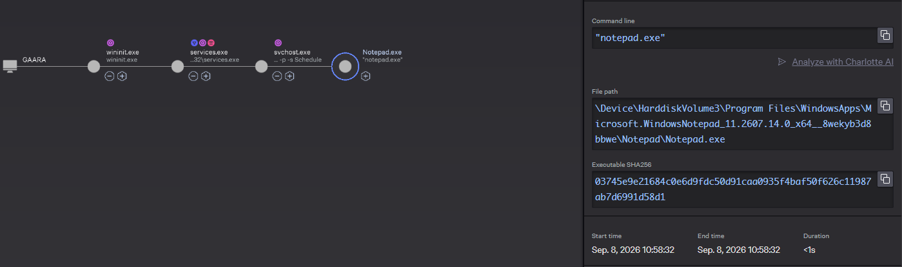
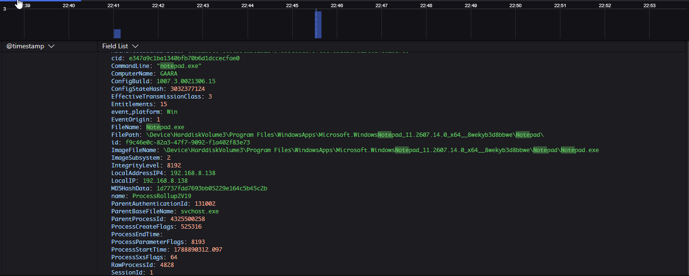
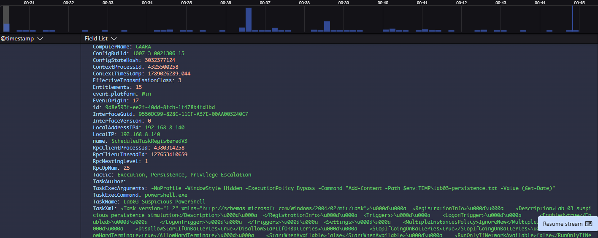
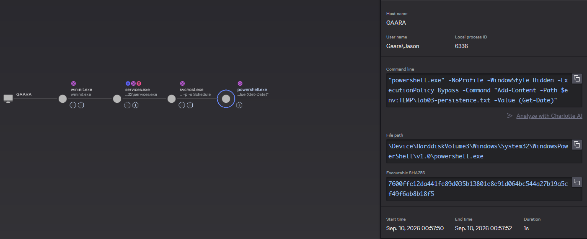
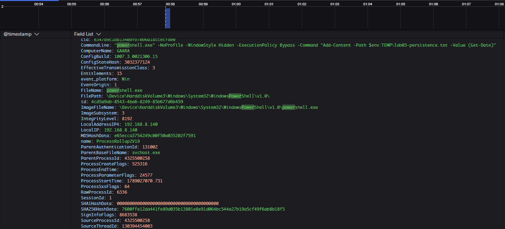
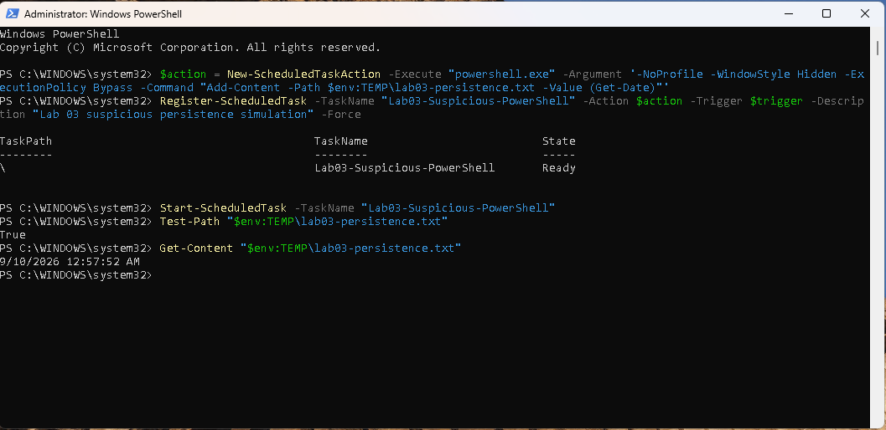

# Lab 03 — Scheduled Task Persistence: Benign vs Suspicious Execution

## Executive Summary

This lab demonstrates how legitimate Windows Scheduled Tasks can be used for both normal automation and suspicious persistence.

Using a Windows 11 virtual machine with CrowdStrike Falcon, I compared a benign scheduled task that launched Notepad with a more suspicious scheduled task configured to run PowerShell at logon with hidden execution and unusual command-line arguments.

Falcon recorded the scheduled-task registration, process ancestry, and PowerShell execution as endpoint telemetry. No detection was generated because the simulated activity remained harmless, but the telemetry showed how analysts can identify persistence-related behavior through trigger context, process ancestry, and command-line details.

## Objective

The objective of this lab is to understand how Windows Scheduled Tasks can be used as a persistence mechanism and how endpoint telemetry can help distinguish legitimate automation from suspicious execution.

The lab focuses on:

- creating a benign scheduled task baseline;
- observing Task Scheduler-related process ancestry;
- creating a suspicious-looking logon-triggered task;
- reviewing PowerShell command-line context;
- comparing benign and suspicious execution;
- understanding the difference between telemetry and detection.

## Environment

- Windows 11 victim VM
- Kali Linux attacker/test VM
- VMware Workstation
- CrowdStrike Falcon sensor installed and communicating
- Falcon prevention policy configured for controlled detect-only lab observation
- Sysmon available for supplemental validation

## Benign Baseline

To establish a normal reference point, I created a scheduled task named `Lab03-Benign-Notepad` that launched `notepad.exe`.

The task was configured with a daily trigger and was executed manually for testing.

The goal was to observe how Windows Task Scheduler launches a legitimate application and establish the normal process ancestry before comparing it with a more suspicious persistence mechanism.

### Falcon Task Invocation

Falcon recorded the command used to request execution of the scheduled task:

```text
schtasks /run /tn "Lab03-Benign-Notepad"
```



*Falcon process telemetry showing `schtasks.exe` invoked from an interactive command prompt to run the benign scheduled task.*

### Falcon Scheduled Task Execution

Falcon also recorded the process created by Windows Task Scheduler.

The resulting process ancestry showed:

```text
wininit.exe
   ↓
services.exe
   ↓
svchost.exe
   ↓
Notepad.exe
```



*Falcon process tree showing Task Scheduler-related service activity launching `Notepad.exe`, establishing the benign scheduled-task execution baseline.*

The important observation was that `schtasks.exe` did not directly launch Notepad. Instead, the task request was handled through Windows service infrastructure, and `svchost.exe` became the parent process of `Notepad.exe`.

This demonstrated why process ancestry matters when investigating scheduled execution.

## Suspicious Scheduled Task Persistence

For the suspicious persistence simulation, I created a scheduled task configured to run at user logon and launch PowerShell with hidden execution and additional command-line arguments, including `-NoProfile` and `-ExecutionPolicy Bypass`.

For the purpose of the lab, I manually triggered the task instead of logging off and back in, then reviewed the resulting Falcon telemetry to compare the execution context with the benign scheduled task.

### Scheduled Task Registration

Falcon recorded the scheduled task at the time it was registered, before the task was executed.

The telemetry showed the task name, the executable it was configured to launch, the PowerShell arguments, and contextual tactic information related to scheduled-task activity.

This was valuable because it provided visibility into the persistence mechanism before the PowerShell process ever ran.



*Falcon telemetry showing registration of the suspicious scheduled task, including the logon trigger, PowerShell execution, and command-line arguments associated with the persistence mechanism.*

### Suspicious Scheduled Task Process Tree

After the task was triggered, Falcon recorded the resulting execution chain.

The process ancestry showed:

```text
wininit.exe
   ↓
services.exe
   ↓
svchost.exe
   ↓
powershell.exe
```

This differed from the benign task, which used the same Windows service infrastructure but ultimately launched `Notepad.exe`.

The ancestry itself does not prove malicious activity, but when combined with the PowerShell command line and logon trigger, it created a more suspicious execution context.



*Falcon process tree showing Windows service activity launching `powershell.exe` through the scheduled task.*

### PowerShell Process Event

Falcon also recorded the PowerShell process event and preserved the full command-line context.

The command line included:

- `-NoProfile`
- `-WindowStyle Hidden`
- `-ExecutionPolicy Bypass`
- a harmless command that wrote a timestamp to a local text file

These arguments created a more suspicious execution pattern than the benign Notepad task, even though the action itself remained harmless.



*Falcon process telemetry showing `powershell.exe` launched by `svchost.exe` with hidden execution, `-NoProfile`, and `-ExecutionPolicy Bypass` during the scheduled-task persistence simulation.*

### Local Validation

The scheduled task successfully executed and wrote a timestamp to the harmless marker file:

```text
%TEMP%\lab03-persistence.txt
```

This confirmed that the task executed as configured.



*Local validation confirming the suspicious scheduled task was registered, executed, and successfully wrote a timestamp to the harmless persistence marker file.*

### Detection Result

Falcon did not generate a detection for this activity.

Although the scheduled task created suspicious execution context, the action itself remained harmless. The task launched PowerShell with unusual arguments but ultimately only wrote a timestamp to a local text file.

This demonstrated the difference between suspicious-looking telemetry and activity that is sufficiently malicious to generate a detection.
