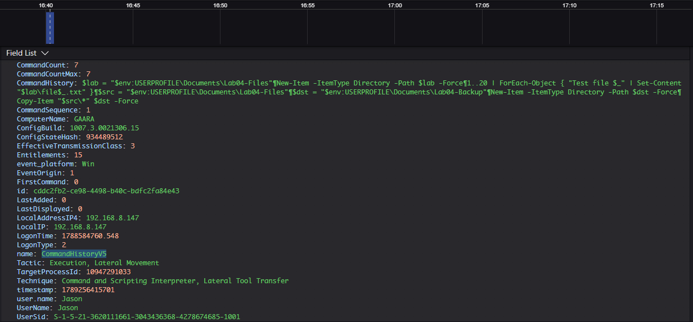
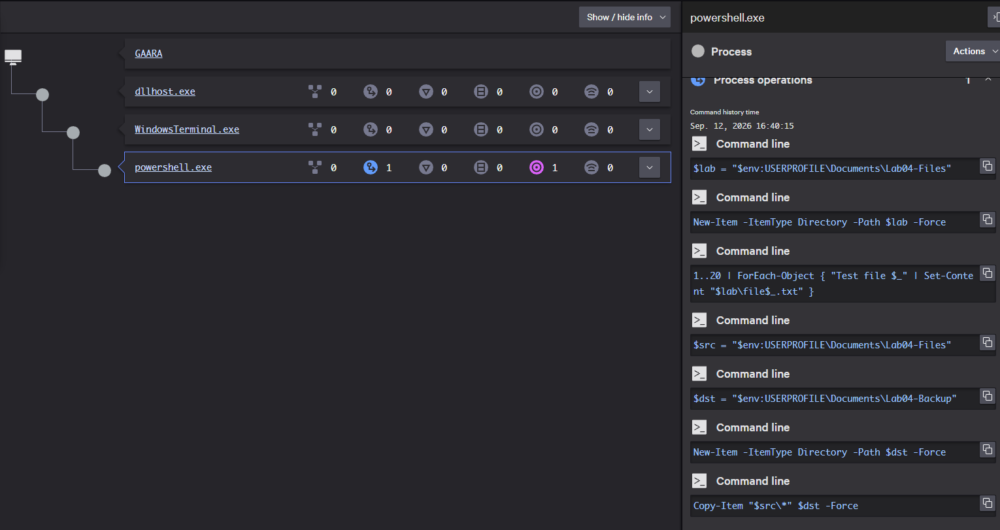
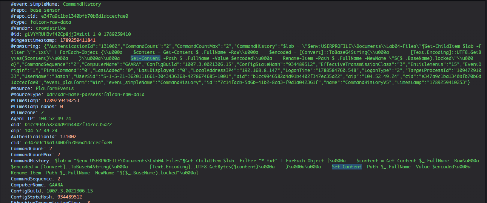
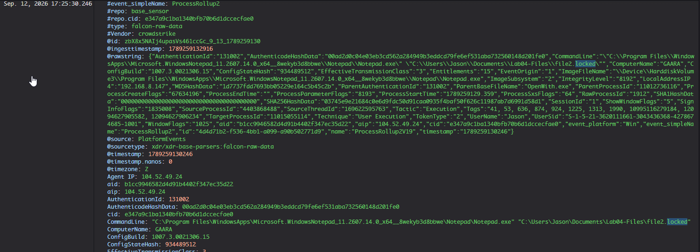

# Lab 04 — Ransomware-Like File Impact: Benign vs Suspicious Execution

## Executive Summary

This lab demonstrates how normal bulk file operations can be compared with suspicious ransomware-like file impact.

Using a Windows 11 virtual machine with CrowdStrike Falcon, I compared a benign PowerShell file-copy operation with a safe simulation that modified the contents of multiple test files and changed their extensions to `.locked`.

Falcon recorded the PowerShell command history for both activities. No detection was generated, but the telemetry provided enough context to distinguish normal file copying from behavior that modified files in place.

## Objective

The objective of this lab is to understand how ransomware-like file activity can differ from legitimate bulk file operations and how endpoint telemetry can help investigate that behavior.

The lab focuses on:

- establishing a benign bulk file-operation baseline;
- reviewing PowerShell command history in Falcon;
- creating a safe ransomware-like file transformation;
- comparing normal file copying with in-place file modification;
- validating the resulting file impact;
- understanding the difference between telemetry and detection.

## Environment

- Windows 11 victim VM
- Kali Linux attacker/test VM
- VMware Workstation
- CrowdStrike Falcon sensor installed and communicating
- Falcon prevention disabled for controlled lab observation
- Dedicated dummy files used for safe testing

## Benign Baseline

To establish a normal reference point, I created 20 harmless text files inside a dedicated test directory.

The source directory was:

```text
Documents\Lab04-Files
```

A second directory was created as a backup location:

```text
Documents\Lab04-Backup
```

PowerShell was then used to copy the test files into the backup directory.

### Falcon Command History

Falcon recorded the PowerShell command history associated with the benign bulk file operation.



*Falcon CommandHistory telemetry showing the benign PowerShell bulk-copy baseline, including creation of the test files and copying them into a backup directory.*

### Falcon Process View

Falcon also provided a process view showing the PowerShell session and individual commands associated with the benign activity.



*Falcon process view showing the PowerShell session and command history used to create the test dataset and perform the benign bulk-copy operation.*


## Suspicious Ransomware-Like File Impact

For the suspicious variant, I performed a safe file-impact simulation against the dedicated Lab 04 test directory.

The PowerShell activity:

- enumerated the `.txt` files;
- read each file's contents;
- converted the contents to Base64 text;
- overwrote the original file contents;
- changed each file extension from `.txt` to `.locked`.

The simulation was intentionally reversible and did not use malware or cryptographic encryption. Base64 encoding was used only as a safe substitute for demonstrating bulk file transformation.

### Falcon Suspicious Command History

Falcon recorded the PowerShell command history used during the file-impact simulation.



*Falcon CommandHistory telemetry showing the ransomware-like simulation enumerating test files, modifying their contents, and renaming them with a `.locked` extension.*

### Post-Impact Validation

Falcon later recorded `Notepad.exe` opening one of the transformed files using its new `.locked` extension.



*Falcon process telemetry showing `Notepad.exe` opening a transformed `.locked` file from the Lab04 test directory, validating that the file-impact simulation changed the file extension as intended.*

### Detection Result

Falcon did not generate a detection for this activity.

The simulation created suspicious file-impact behavior, but it remained confined to harmless dummy files and used a reversible content transformation rather than real ransomware or cryptographic encryption.

Even without a detection, Falcon preserved the PowerShell command history needed to investigate how the files were modified.

## Benign vs Suspicious Comparison

| Benign Baseline | Suspicious File Impact |
|---|---|
| Files were copied into a backup directory | Original files were modified in place |
| Original file contents remained unchanged | Original contents were transformed |
| `.txt` extensions remained unchanged | Extensions were changed to `.locked` |
| PowerShell used `Copy-Item` | PowerShell used file enumeration, content modification, and renaming commands |
| Falcon recorded normal PowerShell command history | Falcon recorded the ransomware-like transformation sequence |
| No detection generated | No detection generated |

The key difference was not simply that PowerShell interacted with multiple files.

The benign activity preserved the original data while creating backup copies. The suspicious variant modified the original files themselves and changed their extensions, making the behavior more worthy of investigation.

## Investigation Findings

The suspicious file-impact activity could be reconstructed using Falcon PowerShell command-history telemetry.

Falcon recorded the sequence used to enumerate the test files, read their contents, transform the data, overwrite the original files, and change their extensions.

The activity could be reconstructed as:

```text
Enumerate files
      ↓
Read contents
      ↓
Transform contents
      ↓
Overwrite originals
      ↓
Rename files to .locked
```

This provided more useful context than simply observing that `powershell.exe` executed.

The investigation showed exactly how the original files were changed and confirmed that the activity remained confined to the dedicated test directory.

## MITRE ATT&CK Mapping

This lab was designed to simulate ransomware-like file impact without performing real encryption.

Because the test used Base64 encoding rather than cryptographic encryption, I did not map the activity directly to T1486 — Data Encrypted for Impact.

The observed behavior demonstrated:

- bulk file enumeration;
- modification of stored file contents;
- overwriting original data;
- file-extension changes;
- ransomware-like impact against a controlled set of dummy files.

### Mapping Notes

MITRE ATT&CK T1486 — Data Encrypted for Impact describes behavior in which adversaries encrypt data to interrupt availability.

This lab intentionally did not perform cryptographic encryption, so claiming T1486 as directly demonstrated would overstate the observed behavior.

Instead, the lab is described as a safe ransomware-like file-impact simulation that reproduces some of the observable characteristics associated with ransomware while remaining reversible and non-destructive.

## How CrowdStrike Falcon Maps to This Scenario

CrowdStrike Falcon provided the primary endpoint visibility used to investigate both the benign and suspicious file activity.

During the benign baseline, Falcon recorded the PowerShell commands used to create and copy the test files.

During the suspicious variant, Falcon recorded the sequence used to enumerate, modify, overwrite, and rename the files.

This allowed the suspicious activity to be reconstructed as:

```text
PowerShell
    ↓
Enumerate test files
    ↓
Read file contents
    ↓
Transform contents
    ↓
Overwrite originals
    ↓
Rename files to .locked
```

Falcon did not generate a detection, but the telemetry still provided enough context to understand how the file-impact behavior occurred.

## Detection vs Prevention vs Investigation vs Response

### Detection

Detection is the process of identifying activity that may be suspicious or malicious.

In this lab, Falcon did not generate a detection for the ransomware-like simulation.

The absence of a detection did not mean the activity was invisible. Falcon still recorded the PowerShell command history needed to reconstruct the behavior.

### Prevention

Prevention is the process of stopping malicious activity before it completes its intended effect.

Falcon prevention was intentionally disabled during this lab so the file-impact activity could execute and the resulting telemetry could be observed.

This lab does not demonstrate Falcon prevention.

### Investigation

Investigation is the process of understanding what happened and determining whether the behavior represents legitimate activity or a security threat.

In this lab, investigation included reviewing:

- the PowerShell process;
- command-history telemetry;
- file enumeration;
- content modification;
- file-extension changes;
- post-impact validation.

Together, these details showed how the activity progressed from file discovery through modification.

### Response

Response is the action taken after suspicious or malicious activity has been confirmed.

If similar behavior were confirmed as malicious in a real environment, an analyst could isolate the affected endpoint, terminate the responsible process, determine which files were affected, remove malicious artifacts, and begin recovery procedures.

This lab focused on visibility and investigation rather than active response.

## Customer Discovery Questions

### 1. How do you currently identify processes that rapidly modify large numbers of files?

**Why it matters:**  
This helps determine whether the customer has visibility into file-impact behavior that could indicate ransomware.

**Useful follow-up:**  
Can your analysts identify which process was responsible for the changes?

---

### 2. Can your team distinguish legitimate bulk file operations from suspicious file modification?

**Why it matters:**  
Backup, migration, and administrative activity can legitimately interact with many files, so additional context is important.

**Useful follow-up:**  
What telemetry do analysts rely on today to make that distinction?

---

### 3. If ransomware-like file activity begins on an endpoint, how quickly can your team determine what happened?

**Why it matters:**  
File-impact attacks can create business disruption quickly, making investigation speed important.

**Useful follow-up:**  
Can your analysts connect the affected files back to the responsible process and command line?

---

### 4. What happens after your team confirms ransomware-like behavior on an endpoint?

**Why it matters:**  
This helps identify the customer's containment, remediation, and recovery workflow.

**Useful follow-up:**  
How quickly can your team isolate the endpoint and determine which files were affected?

## Business Value

This lab demonstrated how suspicious file-impact behavior can create an investigation challenge for a security team.

A process interacting with many files does not automatically indicate ransomware. Backup, migration, and other administrative activities may also touch large numbers of files.

Falcon made the behavior easier to investigate by preserving the PowerShell command history associated with both the benign and suspicious activity.

This allowed the difference between normal file copying and in-place file modification to be understood without relying only on the process name.

For a security team, this type of visibility can support:

- faster triage of ransomware-like activity;
- clearer understanding of file-impact behavior;
- faster identification of the responsible process;
- less manual reconstruction across separate tools;
- more informed containment and recovery decisions.

For security leadership, faster understanding of potential ransomware activity can reduce uncertainty during high-impact incidents and help teams make more confident response decisions.

## SE Talk Track

"In this lab, I compared a legitimate bulk file operation with a safe ransomware-like file-impact simulation.

Falcon recorded the PowerShell command history for both activities, allowing me to see the difference between simply creating backup copies and modifying the original files in place while changing their extensions.

The simulation did not generate a detection, but the telemetry still provided enough context to reconstruct exactly what happened.

The customer value is faster investigation of potential ransomware behavior so analysts can distinguish expected file activity from events that may require containment and recovery."

## Limitations

This lab was designed as a controlled file-impact simulation and does not represent a real ransomware infection.

Key limitations include:

- Only dummy files inside a dedicated test directory were modified.
- No real ransomware or malware was used.
- No cryptographic encryption occurred.
- Base64 encoding was used only as a reversible file transformation.
- No shadow copies or recovery mechanisms were deleted.
- No credential theft, propagation, lateral movement, or external command-and-control activity occurred.
- Falcon recorded the activity as telemetry but did not generate a detection.
- Prevention was intentionally disabled so the activity could execute and be observed.
- The lab demonstrates one example of ransomware-like file-impact behavior and does not represent every ransomware technique.

## What I Learned

This lab taught me that ransomware investigations are not only about identifying a known malicious executable.

The behavior of a process can be just as important. During the benign baseline, PowerShell copied multiple files while preserving the originals. During the suspicious variant, PowerShell enumerated the files, modified their contents, overwrote the originals, and changed their extensions.

I also learned more about the difference between telemetry and detection. Falcon did not generate a detection during the simulation, but it still preserved the PowerShell command history needed to reconstruct the activity.

The biggest lesson was that context matters. Analysts need to understand not only that a process interacted with many files, but which process performed the activity, what commands were executed, and what actually changed.
