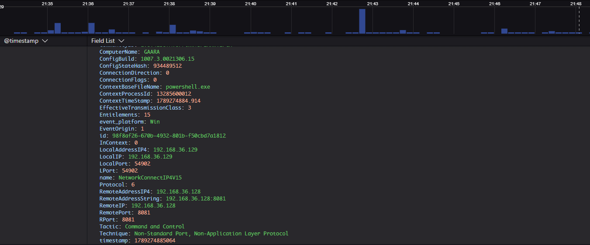
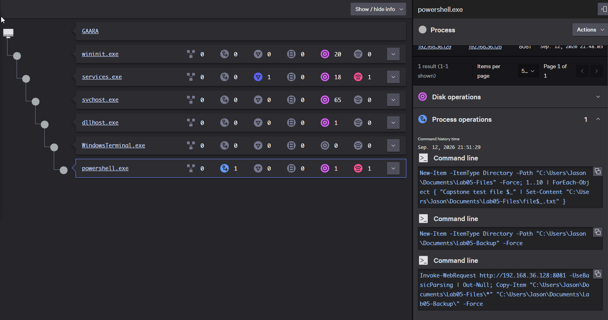

# Lab 05 — Multi-Stage Endpoint Attack Capstone

## Executive Summary

This capstone combined several behaviors from the previous labs into one controlled endpoint sequence.

Using a Windows 11 virtual machine monitored by CrowdStrike Falcon, I first established a benign PowerShell network baseline. I then executed a scheduled-task-based simulation that launched PowerShell through Windows service infrastructure, established an outbound connection to a controlled Kali Linux VM, modified dedicated test files, and launched `cmd.exe` to rename those files from `.txt` to `.locked`.

Falcon did not generate a detection for the capstone sequence, but it recorded the scheduled-task registration, process ancestry, PowerShell command line, network communication, and related execution activity needed to reconstruct the sequence.

## Objective

The objective of this lab was to combine several behaviors from the earlier exercises into one multi-stage endpoint investigation and determine whether CrowdStrike Falcon telemetry could be used to reconstruct the sequence.

The lab focused on:

- establishing a benign PowerShell network baseline;
- scheduled-task persistence;
- PowerShell execution;
- outbound network communication;
- process ancestry and child-process relationships;
- controlled file-impact behavior;
- Falcon investigation and timeline reconstruction.

The suspicious sequence was intentionally non-destructive and limited to systems and files inside the isolated lab environment.

## Environment

- Windows 11 victim VM
- Kali Linux attacker/test VM
- VMware Workstation
- CrowdStrike Falcon sensor installed and communicating
- Falcon prevention disabled for controlled lab observation
- Windows endpoint: `192.168.36.129`
- Kali test system: `192.168.36.128`

## Benign Baseline

Before running the capstone sequence, I generated a harmless PowerShell HTTP request from the Windows endpoint to the Kali Linux VM.

The purpose of the baseline was to establish what normal PowerShell network activity looked like in Falcon before introducing persistence, child-process execution, and controlled file-impact behavior.

### Falcon Network Telemetry

Falcon recorded the PowerShell process establishing an outbound TCP connection from the Windows endpoint to the Kali Linux system.

*Falcon network telemetry showing a benign PowerShell connection from the Windows endpoint to the controlled Kali Linux VM.*

### Falcon Command History

Falcon also preserved the PowerShell command associated with the benign HTTP request.

*Falcon command-history telemetry showing the benign PowerShell HTTP request used to establish the network baseline.*

This baseline demonstrated that PowerShell network communication by itself is not necessarily suspicious. The surrounding execution context and follow-on behavior are what make the later capstone sequence more significant.
