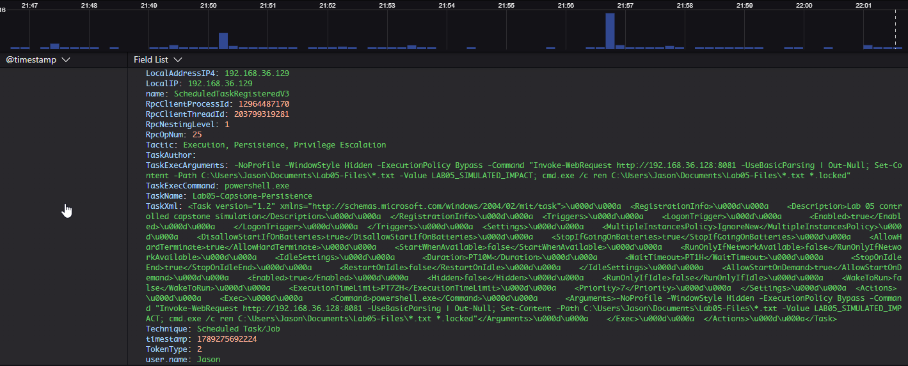
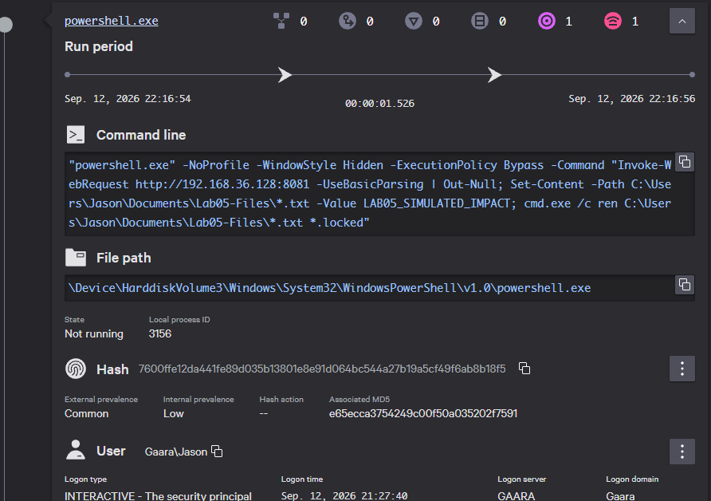

# Lab 05 — Multi-Stage Endpoint Attack Capstone

## Executive Summary

This capstone combined several behaviors from the previous labs into one controlled endpoint sequence.

Using a Windows 11 virtual machine monitored by CrowdStrike Falcon, I first established a benign PowerShell network baseline. I then executed a scheduled-task-based simulation that launched PowerShell through Windows service infrastructure, established an outbound connection to a controlled Kali Linux VM, modified dedicated test files, and launched `cmd.exe` to rename those files from `.txt` to `.locked`.

Falcon did not generate a detection for the capstone sequence, but it recorded the scheduled-task registration, process ancestry, PowerShell command line, network communication, and related execution activity needed to reconstruct the sequence.

## Objective

The objective of this lab was to combine several behaviors from the earlier exercises into one multi-stage endpoint investigation and determine whether CrowdStrike Falcon telemetry could be used to reconstruct the sequence.

The lab focused on:

- establishing a benign PowerShell network baseline;
- scheduled-task persistence;
- PowerShell execution;
- outbound network communication;
- process ancestry and child-process relationships;
- controlled file-impact behavior;
- Falcon investigation and timeline reconstruction.

The suspicious sequence was intentionally non-destructive and limited to systems and files inside the isolated lab environment.

## Environment

- Windows 11 victim VM
- Kali Linux attacker/test VM
- VMware Workstation
- CrowdStrike Falcon sensor installed and communicating
- Falcon prevention disabled for controlled lab observation
- Windows endpoint: `192.168.36.129`
- Kali test system: `192.168.36.128`

## Benign Baseline

Before running the capstone sequence, I generated a harmless PowerShell HTTP request from the Windows endpoint to the Kali Linux VM.

The purpose of the baseline was to establish what normal PowerShell network activity looked like in Falcon before introducing persistence, child-process execution, and controlled file-impact behavior.

### Falcon Network Telemetry

Falcon recorded the PowerShell process establishing an outbound TCP connection from the Windows endpoint to the Kali Linux system.


*Falcon network telemetry showing a benign PowerShell connection from the Windows endpoint to the controlled Kali Linux VM.*

### Falcon Command History

Falcon also preserved the PowerShell command associated with the benign HTTP request.


*Falcon command-history telemetry showing the benign PowerShell HTTP request used to establish the network baseline.*

This baseline demonstrated that PowerShell network communication by itself is not necessarily suspicious. The surrounding execution context and follow-on behavior are what make the later capstone sequence more significant.

## Suspicious Capstone Sequence

After establishing the benign PowerShell network baseline, I progressed the lab into a multi-stage suspicious simulation.

The capstone combined scheduled-task persistence, PowerShell execution, outbound network communication, and controlled file-impact behavior.

The scheduled task was configured to launch PowerShell automatically and execute the full simulation sequence.

### Falcon Scheduled Task Registration

Falcon recorded the scheduled task registration before the task was executed.



*Falcon telemetry showing registration of the scheduled task used to establish the capstone persistence mechanism.*

The registration telemetry provided visibility into the persistence mechanism before the PowerShell process executed.

The resulting activity was designed to follow this sequence:

```text
Scheduled Task
      ↓
Windows Service Infrastructure
      ↓
powershell.exe
      ↓
Outbound HTTP Connection
      ↓
Dummy File Modification
      ↓
cmd.exe
      ↓
.txt Files Renamed to .locked

### Falcon Process Ancestry

After the scheduled task was triggered, Falcon showed the execution passing through Windows service infrastructure before reaching PowerShell and the final child process.

The observed process ancestry was:

```text
wininit.exe
   ↓
services.exe
   ↓
svchost.exe
   ↓
powershell.exe
   ↓
cmd.exe
```

Falcon process tree showing scheduled execution through Windows service infrastructure, followed by powershell.exe launching cmd.exe.

This process tree was important because it showed how the scheduled task actually executed. Rather than schtasks.exe directly launching the final process, Windows Task Scheduler handled the execution through service infrastructure, with svchost.exe acting as the parent of powershell.exe.

The process ancestry provided the context needed to connect the persistence mechanism to the later network and file-impact activity.

### Falcon PowerShell Command-Line Context

Falcon preserved the full PowerShell command line used during the capstone simulation.

The PowerShell process performed three controlled actions:

1. made an HTTP request to the Kali Linux VM;
2. modified dedicated dummy files inside the Lab 5 test directory;
3. launched `cmd.exe` to rename the files from `.txt` to `.locked`.



*Falcon process telemetry showing the PowerShell command responsible for the outbound communication and controlled file-impact stages.*

This was one of the most useful pieces of evidence in the lab because it connected several stages of the capstone to the same PowerShell execution.

Rather than showing only that `powershell.exe` ran, the command-line telemetry explained what the process actually did and provided the context needed to connect the persistence, network, and file-impact stages.

### Falcon Network Activity

Falcon recorded the capstone PowerShell process establishing an outbound TCP connection from the Windows endpoint to the controlled Kali Linux VM.

The network event showed:

```text
Process:         powershell.exe
Local address:   192.168.36.129
Remote address:  192.168.36.128
Remote port:     8081
Protocol:        TCP
```
Falcon network telemetry showing the capstone PowerShell process connecting from the Windows endpoint to the controlled Kali Linux VM at 192.168.36.128:8081.

This network telemetry helped confirm that the outbound connection was tied directly to powershell.exe.

When combined with the process tree and PowerShell command line, the event provided stronger evidence than the network connection alone because it showed which process initiated the communication and where the connection was directed.

### Controlled File Impact

The capstone PowerShell process launched `cmd.exe` to perform the final controlled file-impact stage.

The recorded command was:

```text
"C:\WINDOWS\system32\cmd.exe" /c ren C:\Users\Jason\Documents\Lab05-Files\*.txt *.locked
```
After execution, the dedicated Lab 5 test directory was inspected to confirm the result.

Local validation showing the dedicated Lab 5 dummy files renamed from .txt to .locked after the controlled file-impact simulation.

The files were not encrypted. Their contents were modified and their extensions were changed only to emulate ransomware-like impact safely.

This distinction is important because the lab demonstrates file-impact behavior without claiming that real ransomware encryption occurred.

## Benign vs Suspicious Comparison

| Benign Baseline | Suspicious Capstone |
|---|---|
| PowerShell made a simple HTTP request to the Kali Linux VM | PowerShell was launched through a scheduled-task persistence mechanism |
| Falcon recorded the PowerShell command and outbound network connection | Falcon recorded task registration, process ancestry, command-line activity, and network communication |
| No follow-on process activity was introduced | PowerShell launched `cmd.exe` as a child process |
| No test files were modified | Dedicated dummy files were modified and renamed to `.locked` |
| Activity represented normal network communication | Activity combined persistence, execution, network communication, and controlled file impact |
| No detection generated | No detection generated |

The key difference was not simply that PowerShell made a network connection.

The suspicious capstone added scheduled execution, service-based process ancestry, child-process activity, and file modification. Those additional behaviors created a much richer investigation context than the benign baseline.

This comparison demonstrated why endpoint activity should be evaluated as a sequence of related events rather than as isolated process names or network connections.

## Investigation Summary

Falcon provided enough telemetry to reconstruct the capstone sequence from scheduled execution through controlled file impact.

The observed sequence was:

```text
Scheduled task registered
        ↓
Task executed through Windows service infrastructure
        ↓
powershell.exe launched
        ↓
Outbound connection to 192.168.36.128:8081
        ↓
Dummy files modified
        ↓
cmd.exe launched
        ↓
.txt files renamed to .locked
```
The most useful evidence came from correlating:

scheduled-task registration;
process ancestry;
PowerShell command-line activity;
parent-child process relationships;
network source and destination information;
the final file changes.

No single event explained the entire sequence. The investigation depended on connecting several related pieces of Falcon telemetry into one coherent timeline.

This was the main value of the capstone: demonstrating how endpoint telemetry can be used to move from isolated events to an end-to-end understanding of what happened.

## Detection Result

No Falcon detection was generated for the capstone sequence.

This did not mean the activity was invisible.

Falcon still recorded:

- the scheduled-task registration;
- the PowerShell process and full command line;
- the process ancestry;
- the outbound network connection;
- the `cmd.exe` child process;
- the resulting execution sequence.

This reinforced the difference between telemetry and detection.

**Telemetry** records endpoint activity that can be searched and investigated.

**Detection** surfaces activity that Falcon identifies as sufficiently suspicious or malicious to prioritize for analyst attention.

In this lab, the capstone produced useful investigation telemetry without generating a detection.

## MITRE ATT&CK Mapping

| Observed Behavior | Technique | ID | Evidence |
|---|---|---|---|
| A scheduled task was used to establish automatic execution | Scheduled Task/Job: Scheduled Task | T1053.005 | Falcon scheduled-task registration and service-based execution telemetry |
| PowerShell executed the multi-stage command | Command and Scripting Interpreter: PowerShell | T1059.001 | Falcon PowerShell process and full command-line telemetry |
| HTTP communication occurred over TCP port `8081` | Non-Standard Port | T1571 | Falcon network telemetry showing `powershell.exe` communicating with `192.168.36.128:8081` |

### Mapping Notes

The ATT&CK mappings are limited to behavior that was actually demonstrated in the lab.

The scheduled task maps to **T1053.005 — Scheduled Task/Job: Scheduled Task** because it was used to establish automatic execution through Windows Task Scheduler. PowerShell maps to **T1059.001 — Command and Scripting Interpreter: PowerShell** because it executed the multi-stage capstone command. MITRE currently lists both techniques under those identifiers. :contentReference[oaicite:0]{index=0}

The outbound HTTP connection used TCP port `8081`, supporting **T1571 — Non-Standard Port** for the Command and Control portion of the simulation. :contentReference[oaicite:1]{index=1}

The controlled file-impact stage is **not** mapped to T1486 — Data Encrypted for Impact because the files were not encrypted. The exercise modified and renamed dedicated dummy files only.

Falcon also displayed additional Command and Control-related contextual information during the network event. Those labels are not automatically treated as demonstrated ATT&CK techniques unless the observed behavior supports them.

## Detection vs Prevention vs Investigation vs Response

### Detection

Detection is the process of identifying activity that may be suspicious or malicious.

In this capstone, Falcon did not generate a detection for the multi-stage sequence. The absence of a detection did not mean the activity was invisible, because Falcon still recorded the scheduled-task registration, process ancestry, PowerShell command line, network connection, and child-process activity.

### Prevention

Prevention is the process of stopping malicious activity from executing or completing its intended effect.

Falcon prevention was intentionally disabled during this controlled lab so the full sequence could execute and the resulting telemetry could be observed.

Because the activity was intentionally non-destructive and used only dedicated test files, this lab does not demonstrate Falcon prevention.

### Investigation

Investigation is the process of determining what happened and understanding how related activity fits together.

In this lab, investigation included reviewing:

- the scheduled-task registration;
- the service-based process ancestry;
- the PowerShell command line;
- the outbound network connection;
- the `powershell.exe → cmd.exe` relationship;
- the resulting file changes.

Together, these details made it possible to reconstruct the capstone from persistence through controlled impact.

### Response

Response is the action taken after suspicious or malicious activity has been confirmed.

In a real incident, relevant response actions could include removing the persistence mechanism, terminating malicious processes, isolating the affected endpoint, investigating related systems, and remediating affected files.

This capstone focused on visibility and investigation rather than active response.

## Conclusion

This capstone brought together several behaviors from the earlier labs into one controlled endpoint investigation.

The sequence combined scheduled-task persistence, PowerShell execution, outbound network communication, child-process activity, and controlled file impact. CrowdStrike Falcon recorded the scheduled-task registration, process ancestry, full PowerShell command line, outbound connection to the Kali Linux VM, and the follow-on `cmd.exe` activity used to rename the dedicated test files.

No Falcon detection was generated for the capstone sequence. Even without a detection, Falcon provided enough telemetry to reconstruct the activity from persistence through the final file changes.

The main investigation takeaway is that endpoint visibility depends on correlation. Individual processes or network connections may not explain much by themselves, but process ancestry, command-line context, network telemetry, and related execution activity can be combined to build a clear incident timeline.

This lab reinforced that detection is only one part of endpoint security. Strong investigation context is equally important because it helps analysts understand what happened, determine scope, and make informed response decisions.

## Business Value

This capstone demonstrated how endpoint investigations benefit from having process, command-line, network, and persistence context available together.

A single scheduled task, PowerShell process, or network connection may not explain enough on its own. Falcon made it possible to connect those individual events into a broader execution story and understand how the activity progressed from persistence through network communication and controlled file impact.

For a security team, this type of visibility can support:

- faster triage;
- quicker reconstruction of suspicious activity;
- less manual correlation across separate tools;
- better scoping of affected processes and systems;
- more informed response decisions.

For security leadership, the value is improved analyst efficiency and faster understanding of potentially suspicious endpoint behavior.

## Sales Engineer Takeaway

> "In this capstone, I combined scheduled-task persistence, PowerShell execution, outbound network communication, and controlled file-impact behavior into one endpoint sequence.
>
> Falcon did not generate a detection for this simulation, but it recorded the task registration, process ancestry, command-line activity, network connection, and follow-on process behavior needed to reconstruct what happened.
>
> The key customer value is that endpoint security is not only about generating alerts. Analysts also need enough context to understand how activity unfolded, determine whether it represents risk, and decide what response is appropriate."

## Limitations

This lab was designed as a controlled endpoint-investigation exercise and does not represent a real production compromise.

Key limitations include:

- The exercise occurred entirely inside an isolated VMware lab environment.
- All systems involved were owned and controlled test systems.
- No real malware was used.
- No credentials were accessed.
- No lateral movement occurred.
- The Kali Linux VM was a controlled test destination.
- Falcon prevention was intentionally disabled for observation.
- Only dedicated dummy files were modified.
- The files were not encrypted.
- The `.locked` extension represented simulated impact rather than real ransomware encryption.
- No Falcon detection was generated for the capstone sequence.
- The lab focused on endpoint visibility and investigation rather than a complete incident-response workflow.

## What I Learned

This capstone reinforced that endpoint investigations depend on correlation rather than individual events.

A scheduled task, PowerShell process, outbound connection, or file rename may not explain much by itself. By reviewing the process ancestry, command line, network telemetry, and related execution activity together, I was able to reconstruct how the full sequence occurred.

I also reinforced the distinction between telemetry and detection. Falcon did not generate a detection for this capstone, but it still recorded enough activity to support a meaningful investigation.

The main lesson was that visibility matters even when an alert is not generated. Strong endpoint telemetry helps analysts understand what happened, determine which activity is related, and decide what should be investigated or acted on next.

## Final Takeaway

This lab completed the multi-stage capstone by combining techniques and investigation concepts from the earlier exercises into one sequence.

The strongest evidence came from correlating:

- scheduled-task registration;
- service-based process ancestry;
- PowerShell command-line execution;
- outbound network communication;
- child-process activity;
- controlled file modification.

The capstone showed that a useful endpoint investigation is not built around a single alert. It is built by connecting related activity into a clear and defensible story.
